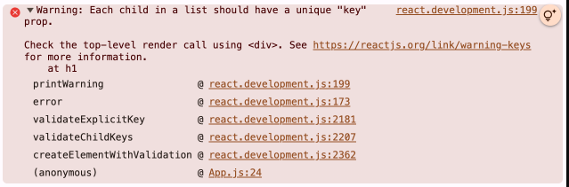

# React Element Structures

Try to create the following structures.

> Type everything on your own.

## Structure 1

```html
<div id="parent">
  <div id="child">
    <h1></h1>
  </div>
</div>
```

## Structure 2

```html
<div id="parent">
  <div id="child">
    <h1>I'm an H1 tag</h1>
    <h2>I'm an H2 tag</h2>
  </div>
</div>
```

### React Warning

When rendering multiple children as a list, React may show the following warning:

> **Warning:** Each child in a list should have a unique `key` prop.



## Structure 3

```html
<div id="parent">
  <div id="child1">
    <h1>I'm an H1 tag</h1>
    <h2>I'm an H2 tag</h2>
  </div>

  <div id="child2">
    <h1>I'm an H1 tag</h1>
    <h2>I'm an H2 tag</h2>
  </div>
</div>
```

## React Without JSX

At its core, React can work like the code written in `App.js`, where `React.createElement()` is used to create elements.

Writing deeply nested UI structures using `React.createElement()` quickly becomes difficult to read and maintain.

This cumbersome structure is one of the main reasons JSX is useful.
